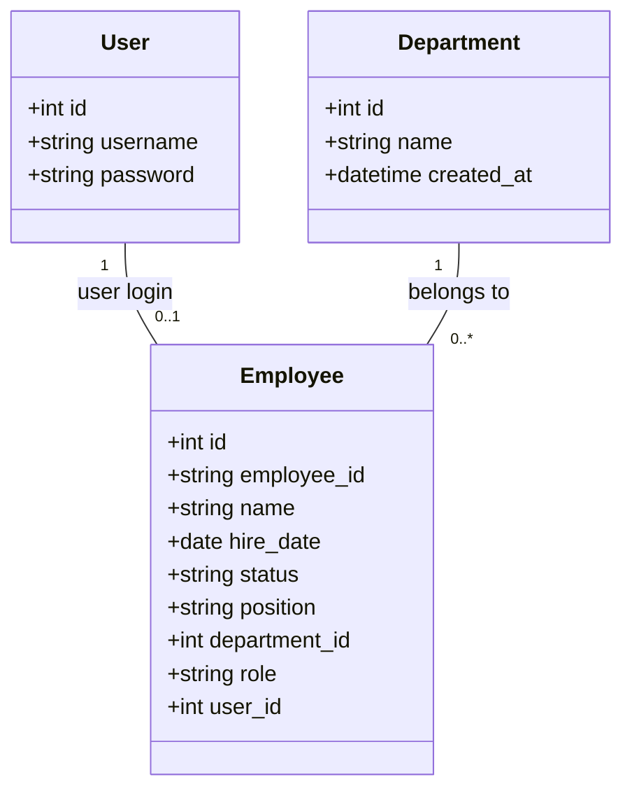

# Design Specification: Enterprise Workflow Management System (Phase 1)

This document specifies the architecture, data models, and authentication system for Phase 1 of the Enterprise Workflow Management System. The focus of this phase is Authentication & Authorization (FR-01) and Employee Profile Management (FR-02).

## 1. Overview & Goals
The goal of this phase is to build a secure, roles-aware foundation using Django, enabling users to log in, verifying their profiles, and allowing administrators (Super Users and Admins) to manage departments and employee directories.

## 2. Technology Stack & User Interface
* **Backend Framework:** Django 6.0.2 (using standard SQLite database)
* **Frontend Architecture:** Django Templates (HTML/JS) rendered server-side
* **Styling System:** Custom Vanilla CSS supporting **both Light Mode (Enterprise Indigo) and Dark Mode (Slate Tech)**, dynamically switchable via a toggle button.
* **Layout Structure:** **Collapsible Sidebar Navigation Layout** (a left sidebar that can be collapsed or hidden, and a scrollable main content area).

### 2.1 Dynamic UI Controls

#### 2.1.1 Dark/Light Theme Toggle
* **Theme Switching Logic:** 
  - A toggle button will be placed in the header.
  - Clicking the button runs a JavaScript function that toggles the `.dark-mode` class on the HTML `<body>` element.
  - The preference is saved in `localStorage.setItem('theme', 'dark' | 'light')` so it persists across navigation and page reloads.
  - On page load, a lightweight blocking script in the `<head>` checks `localStorage` and applies the class immediately to prevent visual flash.
* **CSS Variable Styling:**
  - CSS variables define the colors and are overridden when the `.dark-mode` selector is present:
    ```css
    :root {
      /* Indigo Light Theme Variables */
      --bg-primary: #f8fafc;
      --bg-sidebar: #1e1b4b; /* Indigo */
      --text-main: #334155;
    }
    body.dark-mode {
      /* Slate Tech Dark Theme Variables */
      --bg-primary: #0f172a;
      --bg-sidebar: #0f172a;
      --text-main: #e2e8f0;
    }
    ```

#### 2.1.2 Collapsible Left Sidebar
* **Sidebar Toggle Logic:**
  - A menu icon button in the header toggles a `.sidebar-collapsed` class on the main layout container.
  - **Desktop view:** The sidebar shrinks from full width (e.g., `240px`) to compact icon-only width (e.g., `64px`), hiding text labels and showing only icons with tooltips.
  - **Mobile view:** The sidebar slides completely off-screen, and toggles in and out as an overlay.
  - Keeps the dashboard clean and maximizes horizontal space for the Employee list table and forms.


---

## 3. Database Schema

We will introduce two database models to store organization structure and user profiles.



### 3.1 Department Model
Stores dynamically managed business units.
* `id` (AutoField, Primary Key)
* `name` (CharField, max_length=100, unique=True)
* `created_at` (DateTimeField, auto_now_add=True)

### 3.2 Employee Model
Stores profile information and links to a Django login account.
* `id` (AutoField, Primary Key)
* `employee_id` (CharField, max_length=20, unique=True) — Sequential format: `EMP0001`, `EMP0002`. Generated programmatically if not specified on save.
* `name` (CharField, max_length=150)
* `hire_date` (DateField)
* `status` (CharField, max_length=20, choices: `Active`, `Inactive`, `Resigned`, default='Active')
* `position` (CharField, max_length=100)
* `department` (ForeignKey to `Department`, on_delete=models.PROTECT)
* `role` (CharField, max_length=20, choices: `Super User`, `Admin`, `Manager`, `Employee`, default='Employee')
* `user` (OneToOneField to `django.contrib.auth.models.User`, on_delete=models.CASCADE, related_name='employee', null=True, blank=True)

---

## 4. Authentication & Authorization

### 4.1 Login Controls
* Standard username/password login form using Django's built-in `LoginView`.
* Customized templates styled with our Indigo design system.

### 4.2 Profile Check Middleware
A custom middleware, `EmployeeProfileMiddleware`, will intercept every request:
1. If the user is unauthenticated, allow normal routing (redirecting to login for protected views).
2. If the user is authenticated:
   * It checks if `request.user.employee` exists.
   * If the employee profile is missing, redirect to `/access-denied/` with a descriptive message.
   * If the employee profile exists but has a status of `Inactive` or `Resigned`, log the user out and redirect to `/login/` with an error message.
   * If the profile exists and is active, attach the profile object to `request.employee` for convenient view and template access.

### 4.3 Role-Based Access Control (RBAC)
We map view permissions using custom decorators:
* `Super User` & `Admin`: Can perform CRUD operations on `Employee` and `Department`.
* `Manager` & `Employee`: Read-only access to their own dashboard. Attempting to access CRUD paths results in a `403 Forbidden` error.

---

## 5. View & URL Routing Design

| URL Pattern | View Name | Description | Allowed Roles |
| :--- | :--- | :--- | :--- |
| `/login/` | `login` | Login page | All (Unauthenticated) |
| `/logout/` | `logout` | Logs user out | All (Authenticated) |
| `/access-denied/` | `access_denied` | Displays "Profile Not Found" message | Authenticated Users without profiles |
| `/` | `dashboard` | User dashboard showing their profile | All Active Employees |
| `/employees/` | `employee_list` | Table list of all employees | Super User, Admin |
| `/employees/create/` | `employee_create` | Form to create a new employee | Super User, Admin |
| `/employees/<int:pk>/edit/` | `employee_edit` | Form to edit employee profile | Super User, Admin |
| `/employees/<int:pk>/delete/` | `employee_delete` | Delete employee profile | Super User, Admin |
| `/departments/` | `department_list` | Table list of all departments | Super User, Admin |
| `/departments/create/` | `department_create` | Form to create a department | Super User, Admin |
| `/departments/<int:pk>/edit/` | `department_edit` | Form to edit a department | Super User, Admin |
| `/departments/<int:pk>/delete/` | `department_delete` | Delete a department | Super User, Admin |

---

## 6. Verification & Testing Plan

### 6.1 Automated Tests
We will write unit tests using Django's standard TestCase:
* **Authentication Tests:** Verify login/logout flow and correct handling of users without employee profiles.
* **Status Tests:** Verify that authenticated users with `Inactive` or `Resigned` statuses are logged out and denied access.
* **Role Permissions Tests:** Verify that only `Super User` and `Admin` can access Employee/Department CRUD actions, and that `Manager` and `Employee` receive a `403 Forbidden` response.
* **Auto-generation ID Tests:** Verify that saving a new employee automatically assigns sequential IDs like `EMP0001`, `EMP0002` correctly.

### 6.2 Manual Verification
* Deploy the application locally and verify navigation sidebar layouts.
* Log in as different user roles to verify conditional rendering of UI buttons and tabs.
* Perform interactive sorting, filtering, and searching on the Employee Directory table.
